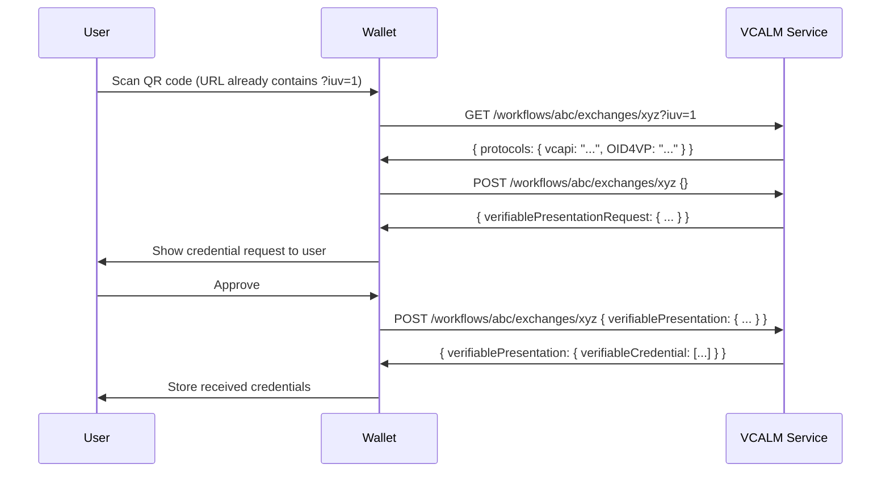

This page documents the end-to-end flow for wallets that initiate a credential
exchange by scanning a QR code. This is the recommended entry point for native
mobile wallets and any wallet that needs to work outside of a browser CHAPI
event.

The foundation for this flow is the
[VCALM (Verifiable Credentials API Lifecycle Management)](https://www.w3.org/TR/vcalm/)
specification.

---

## Overview

The flow has four steps:

1. **Scan** a QR code that encodes an _interaction URL_
2. **Dereference** the interaction URL to discover available protocols
3. **Select** a protocol and initiate the exchange
4. **Complete** the VCALM exchange loop — presenting credentials as requested
   and receiving credentials in return

---

## Step 1 — Scan the QR Code

A QR code in this flow encodes an HTTPS URL called an _interaction URL_. Per the
VCALM spec, the URL MUST contain an `iuv` query parameter set to `1`. Example:

```
https://website.example/interactions/mno456?iuv=1
```

Your wallet scans the QR code and extracts this URL. The URL itself does not
reveal which protocols are supported — that is discovered in Step 2.

---

## Step 2 — Dereference the Interaction URL

To discover the available protocols, send an HTTP GET to the interaction URL
with an `Accept: application/json` header. The `iuv=1` parameter is already
part of the URL from the QR code:

```http
GET /interactions/mno456?iuv=1
Host: website.example
Accept: application/json
```

The response is a `protocols` object listing the supported exchange protocols:

```json
{
  "protocols": {
    "vcapi": "https://vcapi.service.example/workflows/abc123/exchanges/xyz789",
    "OID4VP": "openid4vp://?client_id=..."
  }
}
```

Defined protocol keys:

| Key | Description |
|---|---|
| `vcapi` | VCALM exchange URL — use for the VCALM flow described below |
| `OID4VP` | OpenID for Verifiable Presentations URL |
| `OID4VCI` | OpenID for Verifiable Credential Issuance URL |
| `inviteRequest` | VCALM invite-request response URL |

Your wallet should check which keys are present and select the protocol it
supports. If multiple are present, prefer the protocol your wallet is best
able to handle.

---

## Step 3 — Initiate the Exchange (VCALM)

If your wallet selects the `vcapi` protocol, begin the exchange by sending a
`POST` to the exchange URL with an empty JSON body:

```http
POST /workflows/abc123/exchanges/xyz789
Host: vcapi.service.example
Content-Type: application/json

{}
```

The server will respond with one or more of the following fields:

| Field | Meaning |
|---|---|
| _(empty body)_ | Exchange is complete — nothing further needed |
| `verifiablePresentationRequest` | Server is requesting credentials from the wallet |
| `verifiablePresentation` | Server is offering credentials to the wallet |
| `verifiablePresentation` + `verifiablePresentationRequest` | Server offers credentials and simultaneously requests more |
| `redirectUrl` | Exchange is complete — navigate the user to this URL or handle another interaction URL |

A `4xx` HTTP response indicates an error; the body will contain details.

---

## Step 4 — Complete the Exchange Loop

Exchanges are multi-turn. The wallet and server pass messages back and forth
until neither side has outstanding requests.

### Responding to a Verifiable Presentation Request

When the server responds with a `verifiablePresentationRequest`, inspect the
`query` array to understand what is needed:

```json
{
  "verifiablePresentationRequest": {
    "query": [{
      "type": "QueryByExample",
      "credentialQuery": [{
        "reason": "We need proof of your career credentials.",
        "example": {
          "@context": [
            "https://www.w3.org/ns/credentials/v2",
            "https://w3id.org/citizenship/v1"
          ],
          "type": "PermanentResidentCard"
        }
      }]
    }],
    "challenge": "abc123",
    "domain": "vcapi.service.example"
  }
}
```

Supported query types ([VCALM spec](https://www.w3.org/TR/vcalm/#verifiable-presentation-request)):

- `QueryByExample` — match credentials by `@context` and `type`
- `DIDAuthentication` — prove control of a DID
- `AuthorizationCapabilityQuery` — present a ZCAP authorization capability
- `DigitalCredentialQueryLanguage` — alternative query format

Find the matching credentials in the wallet, build a signed Verifiable
Presentation, and POST it back to the **same exchange URL**:

```http
POST /workflows/abc123/exchanges/xyz789
Host: vcapi.service.example
Content-Type: application/json

{
  "verifiablePresentation": {
    "@context": ["https://www.w3.org/ns/credentials/v2"],
    "type": ["VerifiablePresentation"],
    "holder": "did:example:z6Mk...",
    "verifiableCredential": [{ ... }],
    "proof": { ... }
  }
}
```

### Receiving Credentials

When the response includes `verifiablePresentation`, the server is delivering
credentials to the wallet:

```json
{
  "verifiablePresentation": {
    "@context": ["https://www.w3.org/ns/credentials/v2"],
    "type": ["VerifiablePresentation"],
    "verifiableCredential": [{
      "@context": [
        "https://www.w3.org/ns/credentials/v2",
        "https://w3id.org/citizenship/v1"
      ],
      "type": ["VerifiableCredential", "PermanentResidentCard"],
      "credentialSubject": { ... },
      "proof": { ... }
    }]
  }
}
```

Store each credential in the wallet. If the same response also contains a
`verifiablePresentationRequest`, continue the loop.

### Exchange Complete

The exchange is finished when the server returns either an empty body or a
`redirectUrl`. If a `redirectUrl` is present, offer the user the option to
continue there (e.g., open in browser). If the `redirectUrl` value is
another interaction URL (i.e., it includes `?iuv=1`), then it can be
handled as another interaction to be processed.

---

## Full Exchange Example (JavaScript)

```js
async function runExchange(interactionUrl) {
  // Step 2 — discover protocols
  // interactionUrl already contains ?iuv=1 as encoded in the QR code
  const protocolsResponse = await fetch(
    interactionUrl,
    {headers: {Accept: 'application/json'}}
  );
  const {protocols} = await protocolsResponse.json();

  if(!protocols.vcapi) {
    throw new Error('vcapi protocol not available');
  }

  // Step 3 — initiate exchange
  let body = {};
  let response = await fetch(protocols.vcapi, {
    method: 'POST',
    headers: {'Content-Type': 'application/json'},
    body: JSON.stringify(body)
  });

  // Step 4 — exchange loop
  await handleExchangeResponse(protocols.vcapi, await response.json());
}

async function handleExchangeResponse(exchangeUrl, body) {
  if(Object.keys(body).length === 0) {
    // exchange complete
    return;
  }

  if('verifiablePresentation' in body) {
    // store the received credentials
    await storeCredentials(body.verifiablePresentation.verifiableCredential);
  }

  if('redirectUrl' in body) {
    // offer user option to navigate
    offerRedirect(body.redirectUrl);
    return;
  }

  if('verifiablePresentationRequest' in body) {
    // find matching credentials and respond
    const vp = await buildVerifiablePresentation(body.verifiablePresentationRequest);
    const response = await fetch(exchangeUrl, {
      method: 'POST',
      headers: {'Content-Type': 'application/json'},
      body: JSON.stringify({verifiablePresentation: vp})
    });
    await handleExchangeResponse(exchangeUrl, await response.json());
  }
}
```

---

## OID4* Protocols

If the `protocols` object contains an `OID4VCI` or `OID4VP` key instead of (or
in addition to) `vcapi`, the value is a protocol-specific URL your wallet can
use to continue the flow using those protocols.

Example `OID4VCI` value:
```
openid-credential-offer://?credential_offer=%7B...%7D
```

See [OID4* Integration](/playground/oid4/) for details on the server-side
setup, and refer to the
[OID4VCI Final Spec](https://openid.net/specs/openid-4-verifiable-credential-issuance-1_0.html)
and
[OID4VP Final Spec](https://openid.net/specs/openid-4-verifiable-presentations-1_0.html)
for wallet-side implementation details.

---

## Sequence Diagram


