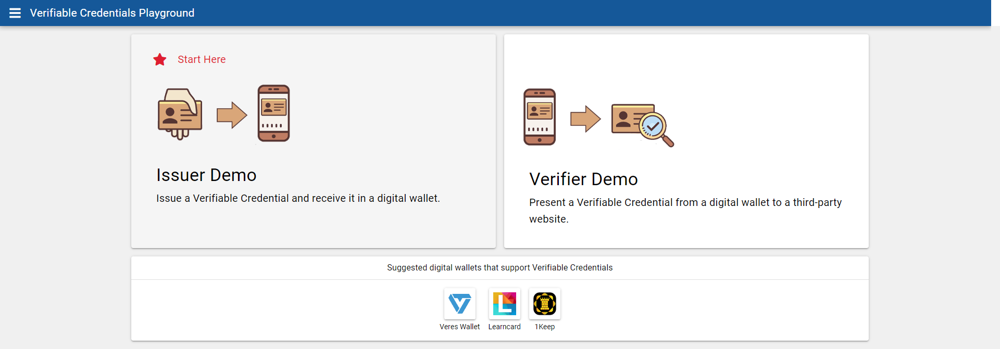
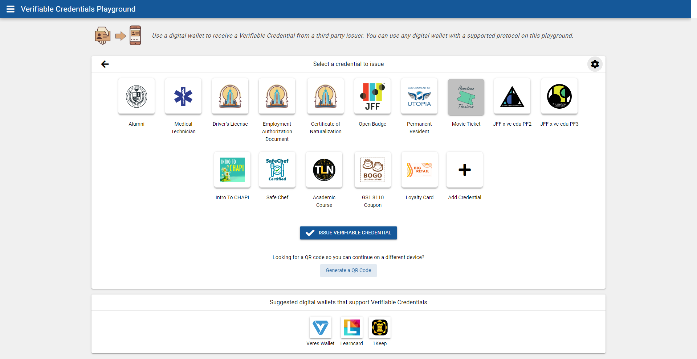
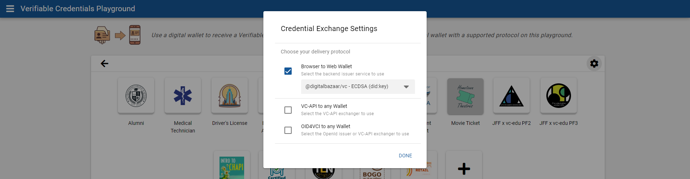
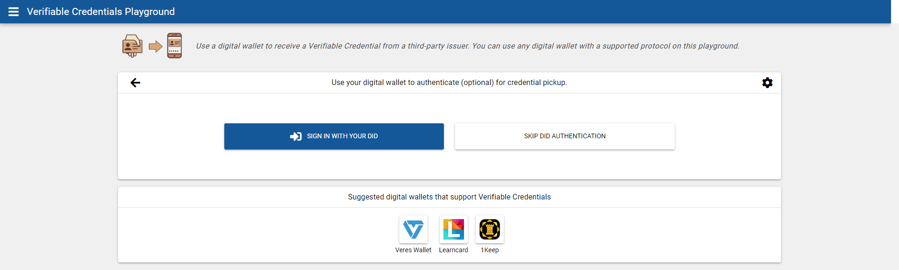
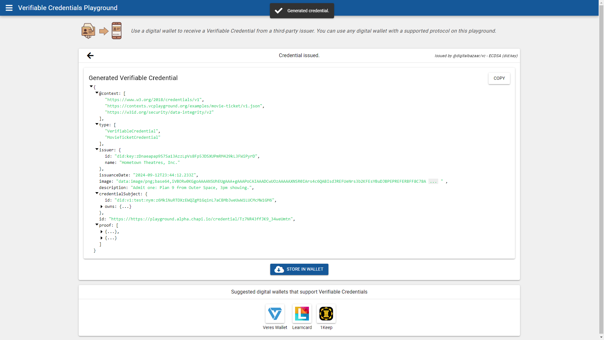
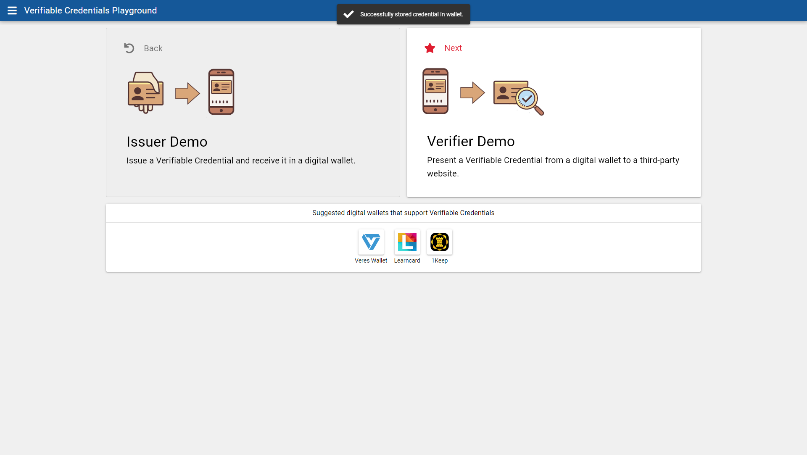
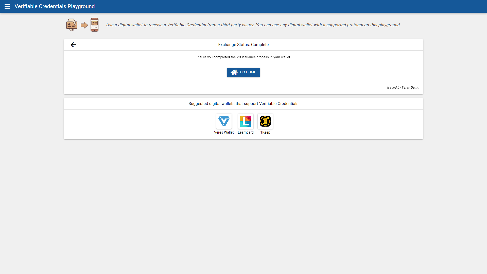
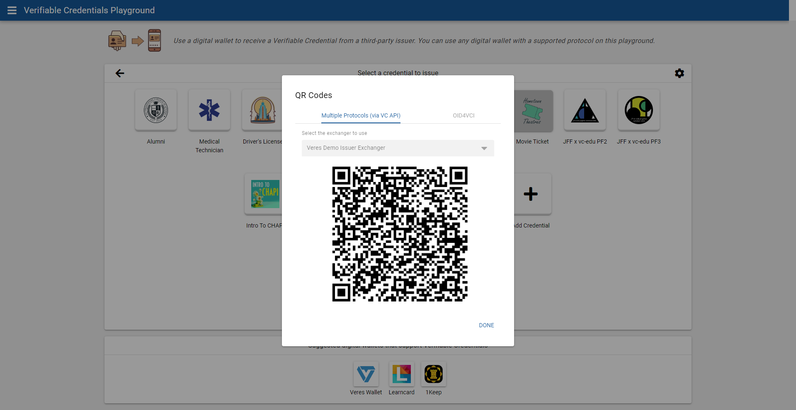

The [VC Playground Issuer](https://vcplayground.org/issuer) allows you to issue
example credentials via several possible Issuer instances.

To begin, choose "Issuer Demo" from the
[VC Playground](https://vcplayground.org/) or go straight to
https://vcplayground.org/issuer



#### If you are developing with CHAPI...
Next, select one of the example credentials (such as "Movie Ticket" highlighted
below) and use the "Cog" button to open the settings panel to select an Issuer.



On the settings screen you can also select between browser-event based
communication or VC API and/or OID4VCI protocol(s) as the delivery method:



The "Browser to Web Wallet" selection will send the credential and DID
authentication information between the VC Playground and your desired Wallet
via browser-based event messages.

Selecting either or both of the protocol options (VC API and/or OID4VCI) will
send a browser-based event message containing a `protocols` object. The Wallet
you select will use the contents of that `protocols` object to select the API
it supports and complete the requested exchange via server-to-server
communication. See [Handling a VC API Exchange](/chapi/wallets/exchanges/) for more information.

Once you've made your selection, press the "Done" button to close the dialog.

Next, press the "Issue Verifiable Credential". You will be shown the option to
use DID Authentication as part of the transaction:



If you choose to "Sign in with your DID", you will be shown the CHAPI Wallet
section dialog. Choose a Wallet to complete authentication. Following
authentication, you'll be shown the issued credential as JSON (see below).

If you choose to "Skip DID Authentication", you'll be shown the issued
credential as JSON (see below).



Lastly, choose "Store in Wallet".

*If you chose to use the "Browser to Web Wallet" experience*, you will be taken
to the VC Playground homepage and shown an alert message about the status of the
browser-based event sent between the chosen Issuer instance and the Wallet you
selected.



*If you chose to use either or both of the VC API and/or OID4VCI protocols*, you
will instead be shown a status page stating the result of the server-to-server
transaction made between the chosen Issuer instance and the Wallet you selected.



Checkout [Handling a VC API Exchange](/chapi/wallets/exchanges/) to read more.


#### If you are reading a QR code...

Press the "Generate a QR Code" button to show the QR code options dialog:



Each QR code will provide a single URL. However, these URLs are meant to be used
from within a Wallet and not meant to be loaded in a browser.

The *Multiple Protocols (via VC API)* option provides an interaction URL that
will provide a `protocols` object allowing for the selection from the available
protocols:

```
https://vcplayground.org/interactions/https%3A%2F%2Fqa.veresexchanger.dev%2Fexchangers%2Fz1A68iKqcX2HbQGQfVSfFnjkM%2Fexchanges%2Fz19jzvwdcS5fuNyyE7R5t5peH
```

Note: if this URL is opened in a browser it will result in a human friendly
error page showing the same QR code again explaining that it is intended to be
used by Wallet software.

A properly built Wallet will send a `GET` request to the interaction URL with an
`Accept` header set to `application/json`:

```http
GET /interactions/https%3A%2F%2Fqa.veresexchanger.dev%2Fexchangers%2Fz1A68iKqcX2HbQGQfVSfFnjkM%2Fexchanges%2Fz19jzvwdcS5fuNyyE7R5t5peH
Host: vcplayground.org
Accept: application/json
```

Here is an example of that request using JavaScript's `fetch()` function:

```js
const interactionUrl = 'https://vcplayground.org/interactions/https%3A%2F%2Fqa.veresexchanger.dev%2Fexchangers%2Fz1A68iKqcX2HbQGQfVSfFnjkM%2Fexchanges%2Fz19jzvwdcS5fuNyyE7R5t5peH';
const rv = await fetch(interactionUrl, {
  method: 'GET',
  headers: {
    Accept: 'application/json'
  }
});
const json = await rv.json();
/*
{
  "protocols": {
    "oid4vci": "openid-credential-offer://?credential_offer_uri=https%3A%2F%2Fqa.veresexchanger.dev%2Fexchangers%2Fz1A68iKqcX2HbQGQfVSfFnjkM%2Fexchanges%2Fz19jzvwdcS5fuNyyE7R5t5peH%2Fopenid%2Fcredential-offer",
    "vcapi": "https://qa.veresexchanger.dev/exchangers/z1A68iKqcX2HbQGQfVSfFnjkM/exchanges/z19jzvwdcS5fuNyyE7R5t5peH"
  }
}
*/
```

The Wallet should select the value of the protocol it prefers and continue the
transaction via that protocol.

Checkout [Handling a VC API Exchange](/chapi/wallets/exchanges/) for further
information on completing an exchange.

Alternatively, the OID4VCI QR code will provide a URL with the
`openid-credential-offer://` scheme:

```
openid-credential-offer://?credential_offer_uri=https%3A%2F%2Fqa.veresexchanger.dev%2Fexchangers%2Fz1A68iKqcX2HbQGQfVSfFnjkM%2Fexchanges%2Fz19jzvwdcS5fuNyyE7R5t5peH%2Fopenid%2Fcredential-offer
```

Read
[Sending Credential Offer by Reference Using `credential_offer_uri` Parameter](https://openid.net/specs/openid-4-verifiable-credential-issuance-1_0-ID1.html#name-sending-credential-offer-by-)
in the OID4VCI specification for further details.